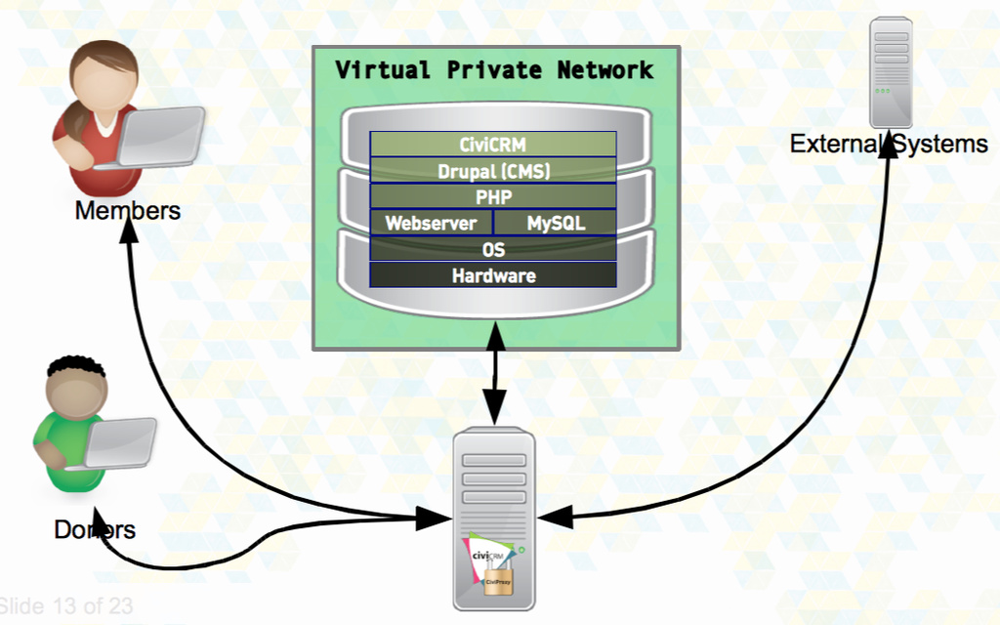

# Introduction

## Public facing website and CiviCRM
In the CiviCRM world it is a fairly typical requirement to want your public facing website and CiviCRM to communicate with each other.
You would probably want to do stuff like:

* Allow website visitors to sign a petition, make a donation or register for an event.
* Allow registered website visitors to view and perhaps update their own data.
* Get website visitors to sign up (or unsubscribe) for newsletters.

However, for security and maintainability purposes it is recommended that you separate your CiviCRM installation and your public facing website. Factors that might influence this:

* Your biggest security risk is probably your public facing website where you want the whole world to be able to check, browse and do stuff, even without identifying themselves.
* The data you want to protect the most is quite likely to be part of CiviCRM (data on your donors, peope who sign petitions, email addresses etc.).
* You will need to install security upgrades on your website regularly as this is exposed to the public. However, you do not want to test all your business processes with each upgrade (which you will need to do if you have both website and CiviCRM on the same server to be sure they continue to work together).

So we think it is a sound practise to separate CiviCRM and your public facing website, and mainly use the CiviCRM API to send data to or get data from CiviCRM. 

However, we do not want every authorized user to be able to use all the API possibilities. And we also do not want to allow any user access to the CiviCRM API.

And that is where **CiviProxy** comes in!
## How does it work?
The basic idea is to first put your CiviCRM (with probably a dummy CMS which you could use for your intranet) server into a VPN. This makes the server virtually inaccessible from the internet, and your users or your whole office will access it via a secure connection.

But what about your public web pages, donation pages, data exchange with other systems, API request? This is where CiviProxy comes in: You get a small, secure, extra server and give it access to both, the internet and your VPN. It will act as a safe gateway for selected features of your CiviCRM that you would like to expose.

In an example picture:

    
The advantages in a nutshell :thumbsup:

* CiviProxy is CiviCRM specific, so it kind of understands how CiviCRM works. It is **designed** to work with CiviCRM in a fairly simple way.
* CiviProxy uses **whitelisting**. This means it starts with the principle _nothing is allowed_ and then lets you configure what is allowed, rather than the other way around.
* CiviProxy uses **parameter sanitation**, meaning that only named parameters are allowed, and then only with the allowed content type (string, integer etc.).
## What can it do?
Currently CiviProxy can expose/relay the following CiviCRM functions

1. Serve resources for newsletters and mailings.
1. Cache those resources, taking load off your CiviCRM server.
1. Pass-through of tracking data on opening and click-through rates.
1. Sign-on and off of your newsletter (Webpage templates).
1. Relay of whitelisted REST API calls for data exchange with other systems.
1. Perform input sanitation and parameter whitelisting for the REST API calls.

!!! attention
    This software has not (yet) been audited for security.
## Why not an application firewall?
The traditional approach to this problem would be an application firewall / reverse proxy setup. However, CiviCRM can have very complex interactions with other systems (e.g. via the API), and a malicious request can sometimes only be detected by understanding the meaning of the individual parameters.

Creating firewall rules for this level of detail is very complex and is very hard to maintain.

For this reason we wanted to take another approach and build a simple "bridgehead" system that *understands* CiviCRM, thus making its configuration and maintenance as easy as possible.

## Contents of this guide
In this guide you will find pages on:

* [technical requirements for CiviProxy](requirements.md)
* [how to install CiviProxy](installation.md)
* [how to configure CiviProxy](configuration.md)
* [what to do if an outside application wants to communicate with CiviProxy](outside.md)
* [future enhancements for CiviProxy](enhancements.md)

!!! note
    This documentation is based on release 0.4 of CiviProxy. 
    
!!! note
    In the guide we assume Drupal is the CMS of your target CiviCRM. Most of the stuff is CMS agnostic but you might have to change some of the URL's in the examples. 